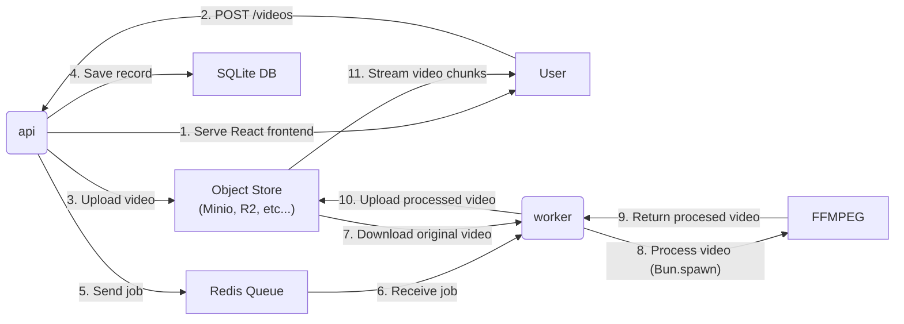

# video-stream

A video transcoding and streaming project powered by Bun runtime and bundler full-stack capability.

## Packages

- `packages/api`: A Hono backend api with React frontend bundled by Bun.
- `packages/shared`: Shared packages including Redis queue data contracts.
- `packages/worker`: A Bun worker that takes in job data from Redis queue and using `ffmpeg` to transcode videos into streamable files.

## How it works?



## Run

You can use the [docker compose](./docker-compose.yaml) file to run this project with Redis and Minio.

```bash
docker compose up
```

This will build the local packages (`api` and `worker`) along side with Redis and Minio instance for queues and object store respectively.
